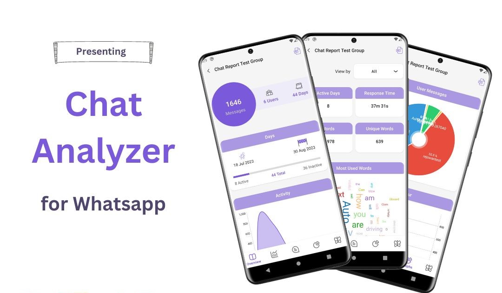

# WhatsApp Chat Analyzer

## Overview
WhatsApp Chat Analyzer is a tool designed to analyze and extract insights from WhatsApp chat data. This project aims to provide users with valuable information, statistics, and visualizations based on their WhatsApp conversations.

## Features
- **Message Count:** Calculate the total number of messages in the chat.
- **User Activity:** Analyze user activity and message distribution over time.
- **Word Frequency:** Identify the most frequently used words in the chat.
- **Media Analysis:** Count and categorize media (images, videos, documents) shared in the chat.
- **Emotion Analysis:** Analyze and visualize the emotional tone of messages.

## Dependencies
- Python 3.x
- Pandas
- Matplotlib
- NLTK (Natural Language Toolkit)

 >**_Need help?_** 
 >**_Feel free to contact me @ [sshemanthbollepalli@gmail.com](mailto:sshemanthbollepalli@gmail.com?Subject=WhatsApp_Chat_Analyzer)_**

---

 

